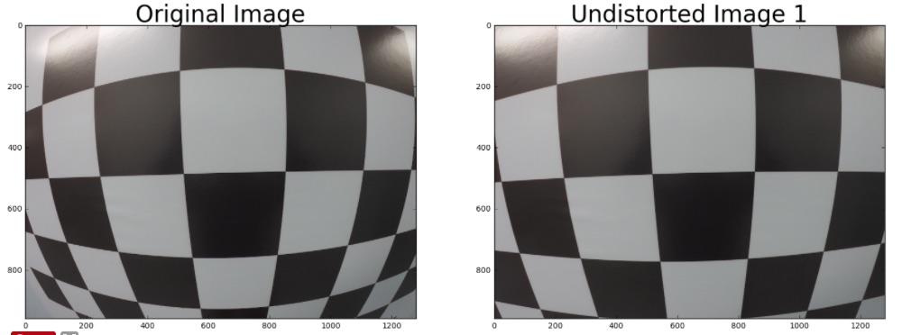
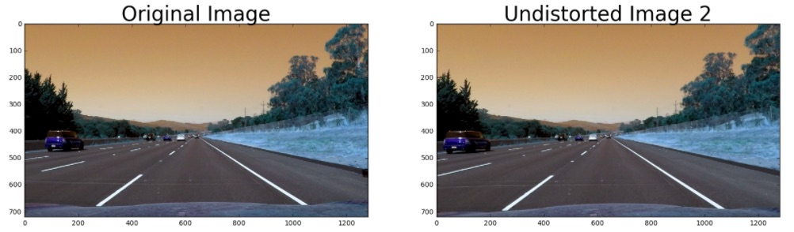
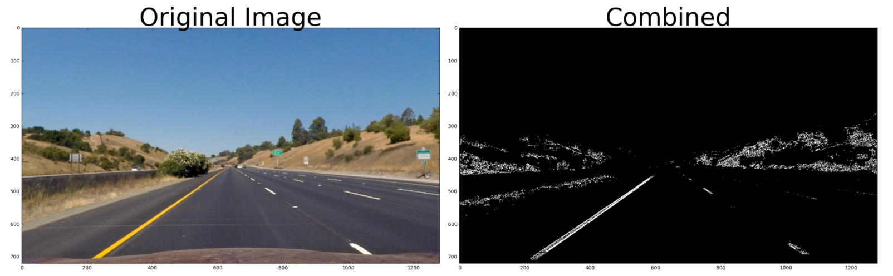
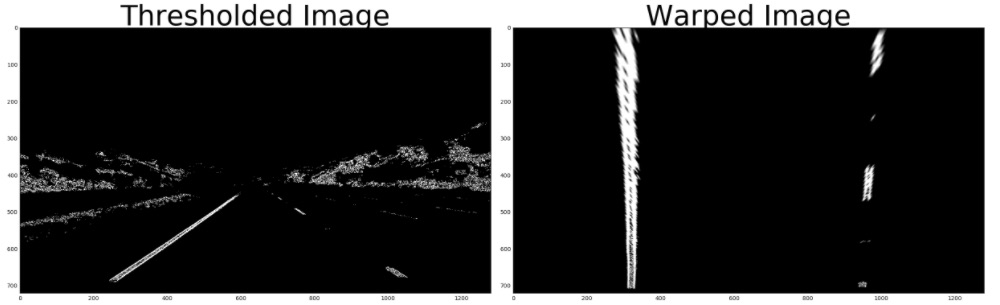
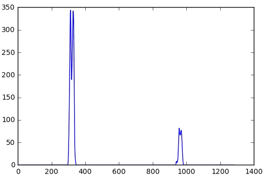
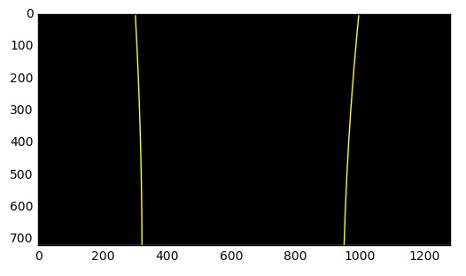
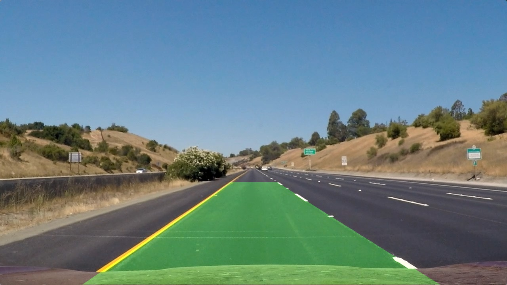

## Writeup Template
### You can use this file as a template for your writeup if you want to submit it as a markdown file, but feel free to use some other method and submit a pdf if you prefer.

---

**Advanced Lane Finding Project**

The goals / steps of this project are the following:

* Compute the camera calibration matrix and distortion coefficients given a set of chessboard images.
* Apply a distortion correction to raw images.
* Use color transforms, gradients, etc., to create a thresholded binary image.
* Apply a perspective transform to rectify binary image ("birds-eye view").
* Detect lane pixels and fit to find the lane boundary.
* Determine the curvature of the lane and vehicle position with respect to center.
* Warp the detected lane boundaries back onto the original image.
* Output visual display of the lane boundaries and numerical estimation of lane curvature and vehicle position.

**Referenced Code Index:** All the code for the project can be found in the `codebase` directory.

| File          | Description   |
| ------------- |:-------------:|
| `codebase/Project 4 - Advanced Lane Finding.ipynb` | Project walkthrough illustrating steps for completing image processing pipeline. |
| `codebase/Undistorter.py`                          | Camera Calibration Class      |
| `codebase/GradientThresholder.py`                  | Gradient and Color Thresholding Class      |
| `codebase/PerspectiveTransform.py`                 | Perspective Transform Class      |
| `codebase/FindingLaneLines.py`                     | Finding Lane Lines Class |
| `codebase/LaneDrawer.py`                           | Plot Polygon Class      |
| `codebase/LaneTracker.py`                          | Image Processing Pipeline Class      |

## [Rubric](https://review.udacity.com/#!/rubrics/571/view) Points
### Here I will consider the rubric points individually and describe how I addressed each point in my implementation.

### Camera Calibration

#### 1. Briefly state how you computed the camera matrix and distortion coefficients. Provide an example of a distortion corrected calibration image.

The code for this step is contained the `codebase/Project 4 - Advanced Lane Finding.ipynb`, cells 2 - 4.

I computed the camera matrix and distortion coeffients based off what was taught on Lessons 3 - 11. You can see the majority of my notes and teachings being implemented in `Undistort (Lesson 4).ipynb`.

When it came to the project, I thought it best to move it to a Python Class, which can be found in `codebase/Undistorter.py`. I start off the `__init__` method by searching for appropriate `.npy` files, which is just a binary file holding a saved array. In the case of the `Undistorter.py`, the separate `.npy` files hold the `objpoints`, `imgpoints`, and `shape`, which we need when we `cv2.calibratCamera()`. If those files are not found, then we go into our `find_corners` method which does the following:

* Use `glob` to grab all the images. `glob` is the most approriate for this use case because this module finds all the pathnames matching a specified pattern. In our case, we want all images that start with `calibration*.jpg'.
* Prepare the "object points", which will be the (x, y, z) coordinates of the chessboard corners in the world. Here I am assuming that the chessboard is fixed on the (x, y) place at z=0, such that the object poionts are the same for each calibration image. So `objp` is just a replicated array of cooridnates, and `self.objpoints` will be append with a copy of it every time I successfully detect all chessboard coarners in a trest image.
* Prepare `self.imgpoints` which will be appended with the (x, y) pixel position of each of the corners in the image place with each successful chessboard detection.

Once `find_corners` is completed, we have `self.objpoints`, `self.imgpoints`, and `self.shape`, meaning we can now compute the camera calibration and distortion coefficients using the `cv2.calibrateCamera()` function.

**Chessboard:**

**Straight Lane Lines:**

The Straight Lane Lines Image is the best example of showing the undistortion of the original image. In the original image, notice that the car (possibly a Fiat) on the left is located roughly at 100 on the x-axis. Undistorting the image moves the car location to near 0 on the x-axis.

---

### Pipeline (single images)

#### 1. Provide an example of a distortion-corrected image.

I believe I answered this with the previous (1. Briefly state how you computed the camera matrix and distortion coefficients. Provide an example of a distortion corrected calibration image).

---

#### 2. Describe how (and identify where in your code) you used color transforms, gradients or other methods to create a thresholded binary image.  Provide an example of a binary image result.

I used a combination of gradient and color thresholds to generate a binar image (threshold steps are located in `codebase/Project 4 - Advanced Lane Finding.ipynb`, cells 5 - 10. Similar to the calibration step, I made a Python Class for the creation of a binary image, which is located
at `codebase/GradientThresholder.py`.

* `codebase/GradientThresholder.py` incorporates a magnitude and direction threshold function. I went about also refactoring majority of the duplicate code, such as `grayscaling` of an image.
* `codebase/GradientThresholder.py` also contains something I found as I was researching color spaces. Mehdi Sqalli had a very good write up on [color thresholding](codebase/GradientThresholder.py). This also helped validate my usage of the HSV color space versus the HLS. Our lesson kind of touched on this but I feel this could be a whole semester to truly understand color spaces and the effects on imagery.

HSV makes more sense to me in this situation because it allows us to filter much more easily by focusing on the hue and saturation of the pixel (which color it is and how intense the color is), and not so much on its value (how dark it is), thus handling shadows and overall worse lighting conditions much more easily. So if we want to focus on yellow and/or white lines, HSV allows us that capability.

**Threholding:**

---

#### 3. Describe how (and identify where in your code) you performed a perspective transform and provide an example of a transformed image.
The code for my perspective transform includes:

* File: `codebase/Project 4 - Advanced Lane Finding.ipynb` - Cell #11
* File: `codebase/PerspectiveTransform.py` - The `__init__` method creates the perspective transform matrix (`getPerspectiveTransform()`), which will be used by the `warp` function. The `warp` function actually returns the warped image by using `cv2.warpPerspective()`.

I utilized source and destinations points provided by Udacity.

| Source        | Destination   |
|:-------------:|:-------------:|
| 585, 460      | 320, 0        |
| 203, 720      | 320, 720      |
| 1127, 720     | 960, 720      |
| 695, 460      | 960, 0        |

**Warped:**

---

#### 4. Describe how (and identify where in your code) you identified lane-line pixels and fit their positions with a polynomial?
My approach was based on the sliding window approach (introduced in Lesson 33) to identify and fit the curve to the lane. The code for the sliding window approach includes:

* File: `codebase/Project 4 - Advanced Lane Finding.ipynb` - Cell #12 - 15
* File: `codebase/FindingLaneLines.py`.

##### Steps:
* I computed a histogram of the warped image to find position of each line. Within `FindingLaneLines.py`, the function `histogram` will return you an array that is able to be plotted within a histogram. The function `find_peaks` will return you the left and right peaks as well as the midpoint betwen those two peaks.

* Then within `detect_lane_lines` (within `FindingLaneLines.py`), we run our sliding window implementation to detect the position of the center of each lane line on each part of the image.
* After all the non-zero point locations in each window (with in the search margin) are collected, a second order polynomial is fit for the data points to identify a global curve (lane) which fits the data.

Now those the curve-fitted lanes can be projected back onto the original image. The code for this can be found in:

* File: `codebase/Project 4 - Advanced Lane Finding.ipynb` - Cell #16-17
* File: `codebase/LaneDrawer.py`.

##### Steps:
* Inverse perspective transformation matrix (`codebase/PerspectiveTransform.py`, Line 14).
* The gist of the code can be found in `codebase/LaneDrawer.py`, method name `plotPolygon`, which overlay the curve fit lines using OpenCV's `addWeighted`.

---

#### 5. Describe how (and identify where in your code) you calculated the radius of curvature of the lane and the position of the vehicle with respect to center.

* File: `codebase/FindingLaneLines.py`.
* File: `codebase/LaneTracker.py`.

Once I had located the lane line pixels, I used their x and y pixel positions to fit a second order polynomial curve:

`f(y) = A(y**2) + By + C`

##### f(y) vs. f(x)
I went about fitting for f(y) because the lane lines in the warped image are nearly vertical, which could have the same x value for more than one y value.

##### Radius of Curvature
As for the radius of the curvature, that was caclulated with the forumula provided in Lesson 35.

`Rcurve = ( (1 + (2Ay + B)^2)^1.5) / abs(2A) )`

Y-values from the image increase from top to bottom. If we want to measure the radius of curvature closest to your vehicle, you could evalute the formula above at the y-value corresponding to the bottom of the image.

##### Position Offset
This is calculated by the distance between `(left_lane_position + right_lane_position) / 2`.

---

#### 6. Provide an example image of your result plotted back down onto the road such that the lane area is identified clearly.

All implementation can be found in `codebase/LaneTracker.py`. That file has essentially everything I did within - `codebase/Project 4 - Advanced Lane Finding.ipynb`, just condensed to successfully create the video.

---

### Pipeline (video)

#### 1. Provide a link to your final video output.  Your pipeline should perform reasonably well on the entire project video (wobbly lines are ok but no catastrophic failures that would cause the car to drive off the road!).

The final result is located in `../project_video_out.mp4`.

---

### Discussion

#### 1. Briefly discuss any problems / issues you faced in your implementation of this project.  Where will your pipeline likely fail?  What could you do to make it more robust?

Initially, the polygon was going out of the lane bounds so that took me a while to figure out. That lead me to toy more with the thresholding. Thresholding feels like a double edge sword after this project. It seems to like it can work really great but can also work against you if you haven't find the right threshold. One clue that helped really get me on the right path was the introduction of the yellow and white masking in HSV to improve lane detection. That kind of blew my mind because we have been so focused on grayscaling and specific color domains that I didn't think to focus on the actual necessary colors. I could see this being a problem in the future though. During construction, the white lines could be tarred out, so this method may not work as great as it does now. Weather conditions could also hinder this type of implementation.

Overall, I really enjoyed this project. Fortuntaly, last week I took an O'Reilly course on Python, so it really helped me understand Python much more and focus my code to move more to a Class oriented implementation. The buggy part for me as when you fix something in the codebase, you would have to "replay" the entire Jupyter Notebook.

